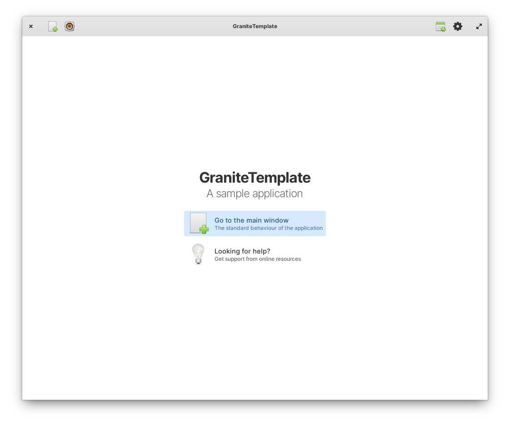

# GraniteTemplate

This is a template repository to ease the process of creating GUI with Vala based on GTK and Granite.



## Dependencies

To build the application, the following dependencies are required:

```
sudo apt update
sudo apt install -y \
    git \
    flatpak-builder \
    meson \
    make
```

Though make is not needed by itself, the compilation instructions use it to make it easier to build, run and debug. 

At the same time, the following requirements are also required and need to be grabbed from Flathub:

```
flatpak install io.elementary.Sdk/x86_64/6
```

Note that you may need to add both, flathub and appcenter repos.


## Installation

Build and install for the current user (which does not require root permissions) the template.
It is recommended to check that it works before doing any change because if not something might be missing:

```
flatpak-builder build-dir com.felixbrezo.GraniteTemplate.json --force-clean --install --user
flatpak run com.felixbrezo.GraniteTemplate
```

It is even easier using `make` because it also deals with translations. 
Check the `Makefile` for further details.

```
make compile_and_run
```

Now, it is time to personalize the name and objects. There is a shortcut in the [`bin` folder](./bin).

```
python3 bin/set_project_name.py com.felixbrezo.MyApp
```

This tiny script will search each name referencing the application in the folder and update it to the new name.
Now, it is time to rebuild the application using the new name:

```
make compile_and_run
```
